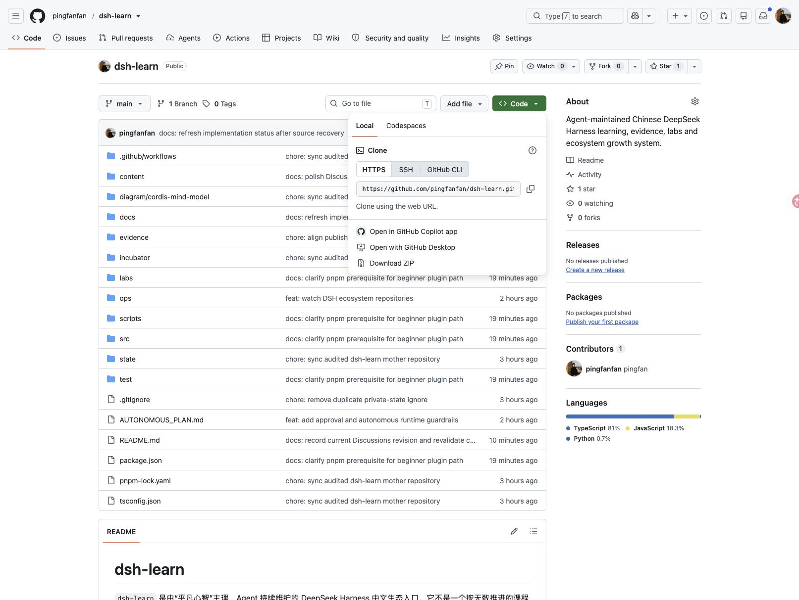
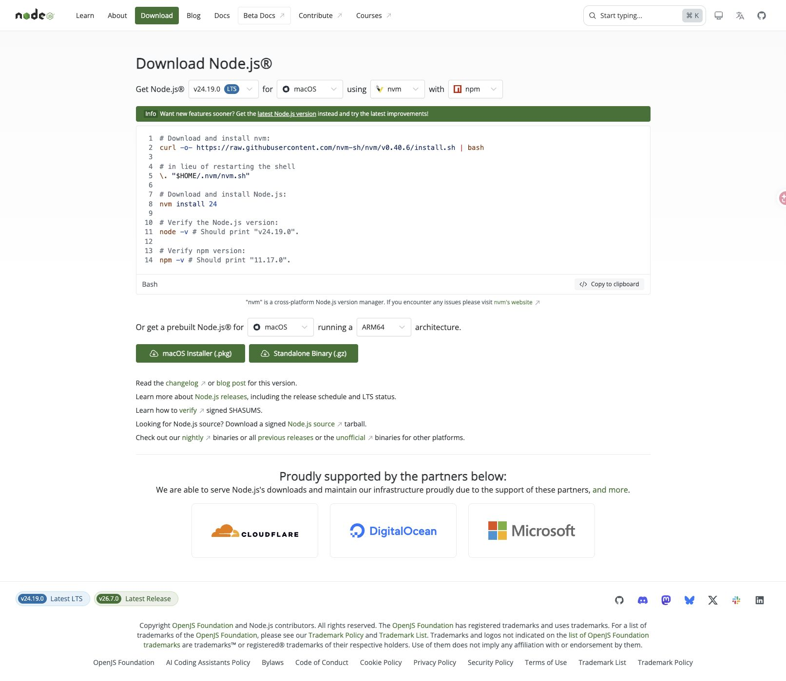
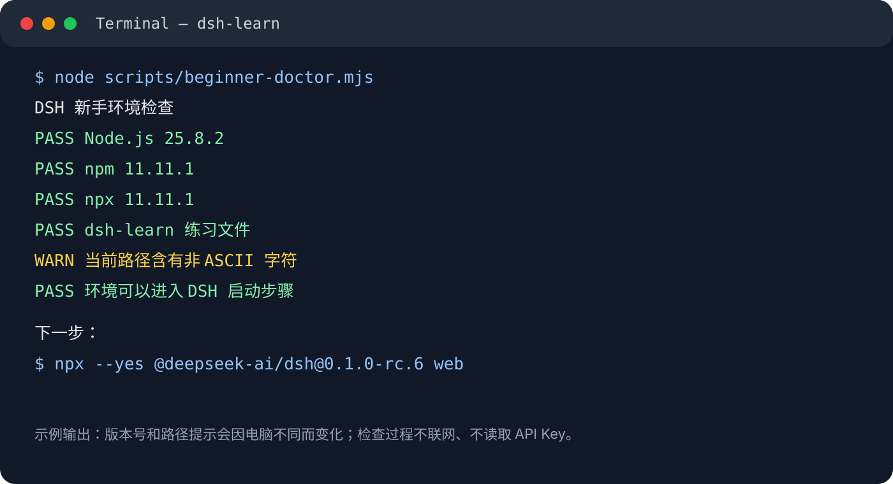
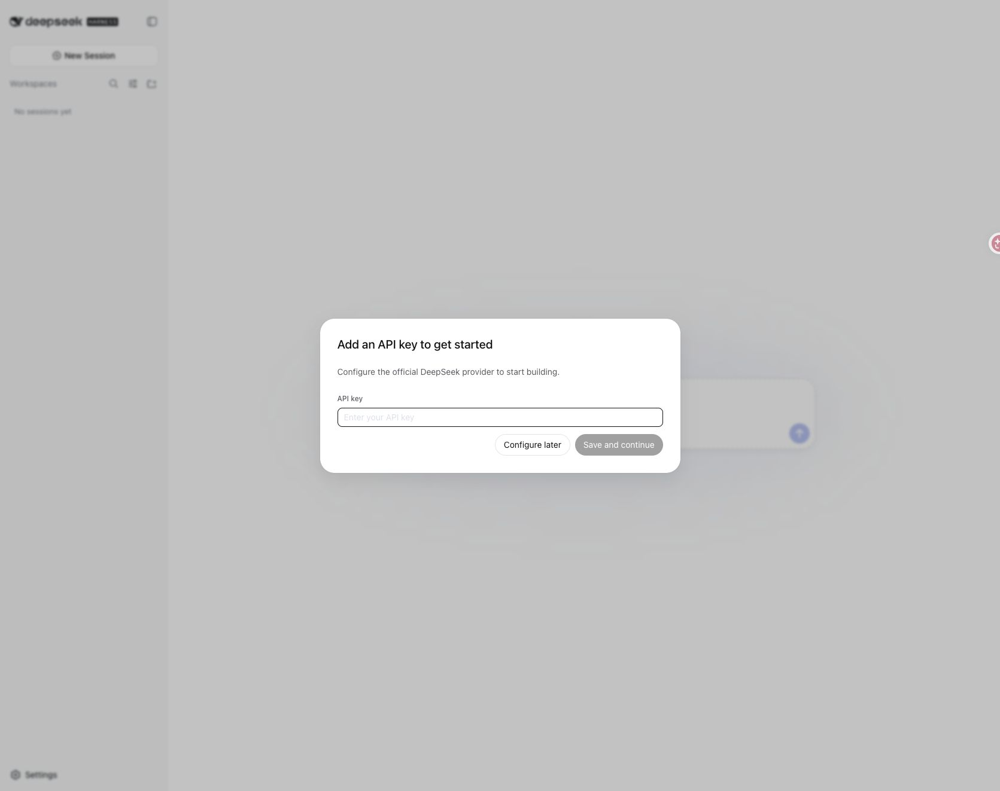
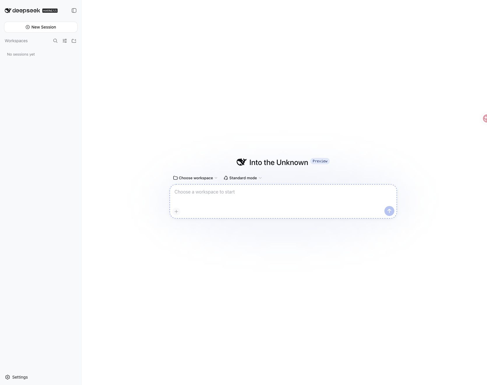
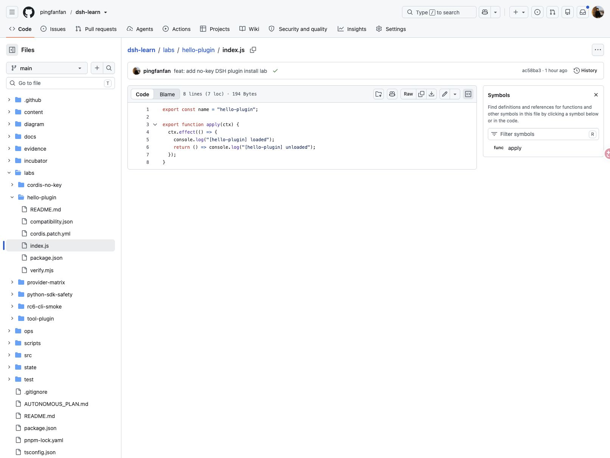

# DSH 完全新手快速上手：从安装到第一个无 Key 插件

这是一张给完全新手的操作卡。你不需要会写代码，也不需要先申请 API Key；跟着做完以后，应该能确认 Node.js 已经准备好、DSH Web UI 能启动，并且能在临时目录里完成一个插件的安装、加载和移除。

本卡固定使用 `@deepseek-ai/dsh@0.1.0-rc.6`，官方仓库基线是 commit `47f9438`。DSH 仍处在 Developer Preview，看到其他教程时，先核对它写的版本。

## 你需要准备什么

你只需要一台电脑、浏览器、Node.js 和本仓库练习文件。macOS 使用 Terminal，Windows 可以使用 PowerShell 或 Windows Terminal，Linux 使用常见终端即可。下面的网页截图主要来自 macOS，命令步骤不因为这组截图而变成 Windows 实测。

先从 GitHub 下载本仓库 ZIP，解压到一个路径较短、只含英文和数字的文件夹，不要求你先学 Git。



再从 [Node.js 官方下载页](https://nodejs.org/en/download/) 安装满足要求的版本：`22.19.0` 或更高的 22.x，或者 24.x 及以上版本。安装完成后重新打开终端。



进入解压后的 `dsh-learn` 文件夹，在这里打开终端，一行一行输入：

```bash
node --version
npm --version
node scripts/beginner-doctor.mjs
```

看到 `PASS 环境可以进入 DSH 启动步骤` 再继续。这个检查只读取本机版本和练习文件，不联网，也不读取 API Key。

如果需要向别人求助，可以追加 `--report`：

```bash
node scripts/beginner-doctor.mjs --report
```

它只在终端打印一份可复制的诊断回执，会明确写出 `PATH=redacted`、`KEY_STATUS=not_read`、`NETWORK=not_checked`；它不上传报告，也不代表 DSH 或插件已经启动。



## 安装并启动 DSH

推荐先输入这条新手启动命令：

```bash
node scripts/beginner-start.mjs
```

它会先确认 Node.js 和 `npx`，再调用固定版本的 DSH；网络、Node 版本或端口出错时，会在原始输出后补一条对应的检查建议。如果你想直接执行底层命令，也可以输入：

```bash
npx --yes @deepseek-ai/dsh@0.1.0-rc.6 web
```

对新手来说，这一步就是“安装并启动 DSH”。`npx` 会下载指定版本并运行它，不需要先全局安装 DSH，也不需要自己配置 PATH。第一次下载可能需要等待一会儿，终端窗口不要关。


浏览器打开：<http://127.0.0.1:3080>


第一次打开网页时，可能会出现 `Add an API key to get started`。现在先点击 `Configure later`，只确认页面能显示，不要把任何 Key 粘贴进截图、文章或仓库。



看到空的 DSH 工作台，说明 Web UI 进程和页面层已经启动；这还不能说明模型 provider 已配置，也不能说明模型请求成功。



## 安装第一个插件

启动 Web UI 只需要 Node.js，但 DSH 的 `plugin` 子命令还会在 profile 中调用 pnpm。先检查：

```bash
node scripts/plugin-doctor.mjs
```

如果提示没有 pnpm，再执行：

```bash
npm install --global pnpm
```

准备真实安装前，可以先做网络检查：

```bash
node scripts/plugin-doctor.mjs --network
```

看到 `PASS npm registry 可达` 后，再运行第一个无 Key 插件实验：

```bash
node labs/hello-plugin/verify.mjs
```

它会创建临时 `DSH_HOME` 和 `demo` profile，安装本地 `hello-plugin`，检查组合配置，启动并等待 `[hello-plugin] loaded`，最后移除插件。实验会排除 `DEEPSEEK_API_KEY` 和 `DEEPSEEK_API_KEY_ENV`，不会发起模型请求，也不会改动你平时的 DSH profile。


第一次成功至少要看到四类信号：安装完成、配置里出现插件、启动日志出现加载信息、移除以后配置恢复。只看到安装命令返回成功，还不能证明插件已经加载。

如果预检提示 `BLOCKED_NETWORK` 或 npm registry 不可达，先检查网络、DNS、代理或防火墙，恢复后重新运行同一条命令；这不能被写成插件代码失败。当前环境的动态安装回执也必须以你自己的终端输出为准。

## 想自己改一个插件

不想手动复制文件时，可以在 dsh-learn 根目录用脚手架生成自己的最小插件：

```bash
node scripts/create-beginner-plugin.mjs my-first-plugin
```

它只生成 `package.json`、`index.js`、`cordis.patch.yml` 和 README，不联网、不读取 Key，也不会覆盖已经存在的目录。生成以后，先用同一个隔离探针验证这个新目录：

```bash
node labs/hello-plugin/verify.mjs ./my-first-plugin
```

验证器会根据你生成的 bundle 名称和 patch 中的插件 id 检查安装、配置、加载和移除。如果你想手动练习，也可以复制 `labs/hello-plugin` 文件夹，把副本改名为 `my-first-plugin`；第一次只修改 `index.js` 里的加载日志，`package.json`、`cordis.patch.yml` 和其他文件先保持不动。



确认本地实验通过以后，再按完整教程逐条观察 `plugin add`、`--dump-config`、启动和 `remove`：

- [完全新手完整教程：从安装到第一个插件](dsh-zero-to-first-plugin-rc6.md)
- [第一个插件实验说明](../../labs/hello-plugin/README.md)
- [完全新手入口地图](../../docs/BEGINNER_ENTRY_MAP.md)

## 遇到问题先看哪一层

| 现象 | 先检查 |
| --- | --- |
| 找不到 `node` | Node.js 是否安装完成，终端是否重新打开 |
| Node 版本不满足 | 安装满足要求的 Node.js，不要先改插件代码 |
| `npx` 长时间没有新输出 | npm registry、网络、DNS、代理或防火墙 |
| 浏览器打不开 `127.0.0.1:3080` | 启动 DSH 的终端是否仍在运行、是否已经报错退出 |
| 没有 pnpm | 运行 `node scripts/plugin-doctor.mjs`，按提示安装 |
| 插件安装了但没有加载日志 | 查看 `--dump-config`、包名、patch 中的 name 和入口文件 |
| 页面能打开但模型不回答 | 这是 provider、模型名、接口地址或凭据问题，不是无 Key 插件实验结果 |

本卡默认不需要 API Key。模型配置、插件安装、插件加载和插件安全是不同的验证层，不要用其中一项替代另外几项。若将本卡改编为知乎内容，发布必须经过主理人明确同意。

> 非官方中文资料。平凡心智主理，dsh-learn Agent 持续维护。
