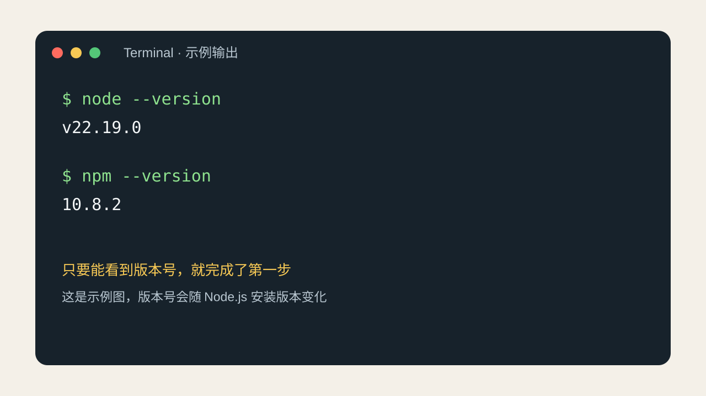
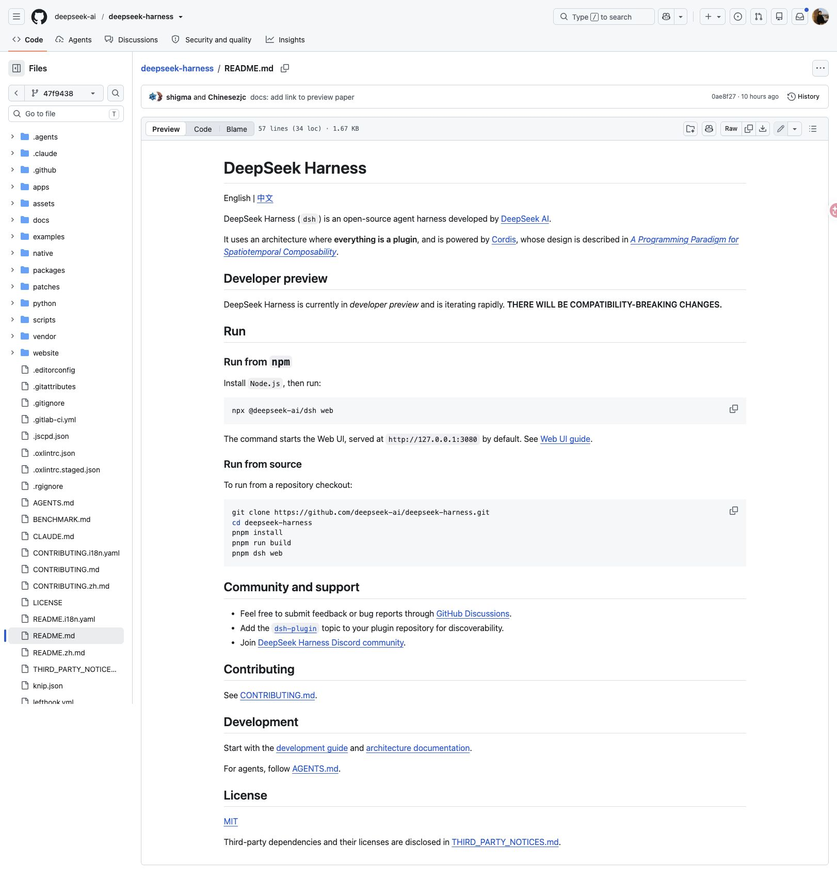
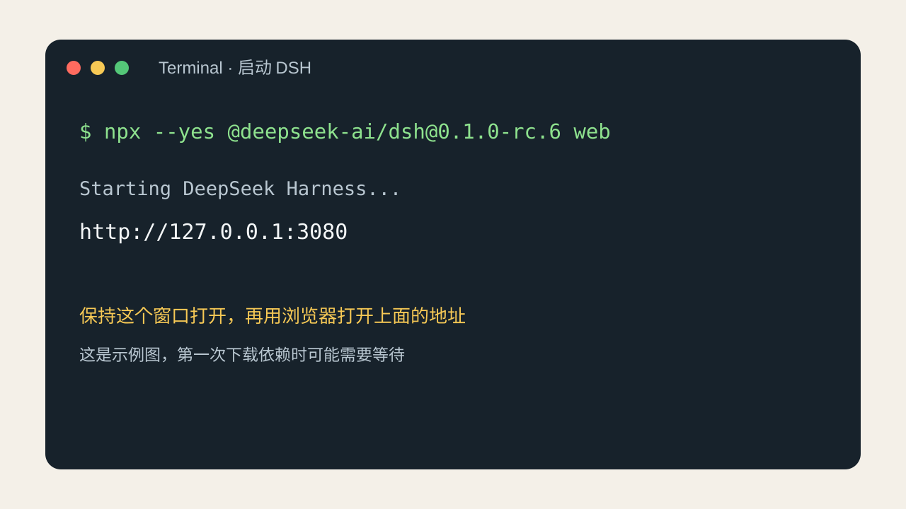
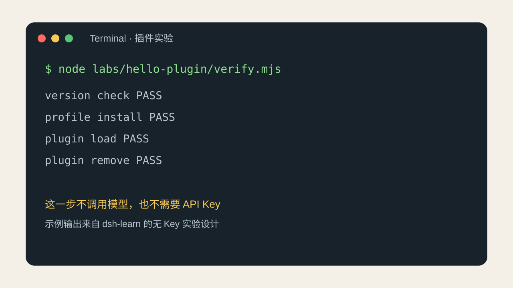

# 标题候选

| 标题 | 点击欲 | 信息量 | 跟我有关 | 可信 | 差异化 | 总分 |
| --- | ---: | ---: | ---: | ---: | ---: | ---: |
| 推荐标题：完全不会写代码，也能启动 DSH 并装上第一个插件 | 10 | 10 | 10 | 10 | 10 | 50 |

# 正文

如果你完全不会写代码，第一次看到 DeepSeek Harness，最容易卡在几个词上，例如 Node.js 是什么，终端在哪里，`npx` 为什么会下载东西，profile 和插件又是什么。

这篇把读者当成零基础。你不需要先理解 Cordis，也不需要先申请 API Key。跟着做完以后，你应该能完成四件事，确认电脑能运行 DSH，打开 DSH 的 Web UI，在隔离环境里安装一个无 Key 插件，知道模型请求应该放在哪一层。

DSH 目前仍是 Developer Preview，版本变化会比较快，下面的命令固定到 `@deepseek-ai/dsh@0.1.0-rc.6`，官方仓库基线固定到 `47f9438`，以后看到旧文章，先找它写的版本，再决定是否照做。

## 你会用到的三个东西

Node.js 是运行 DSH 所需的基础软件，它不是 DSH，也不是模型，你可以把它理解成让电脑能够执行 JavaScript 工具的一套运行环境。

终端是输入命令的窗口，macOS 叫 Terminal，Windows 可以使用 PowerShell 或 Windows Terminal，这里输入的命令只在你的电脑上运行，窗口关掉以后，正在运行的 DSH 也会停止。

浏览器用来打开 DSH 的页面，官方默认地址是本机的 `127.0.0.1` 加 `3080` 端口，它只表示你的电脑，不是一个别人可以访问的公网网址。

这三样东西的关系可以这样记。Node.js 负责执行，终端负责发出命令，浏览器负责显示页面。

## 安装 Node.js

打开 Node.js 官方下载页，选择一个满足 DSH 要求的版本。当前官方根目录的 package manifest 要求 Node.js `22.19.0` 或更高的 22.x，或者 24.x 及以上版本。安装器一路使用默认选项即可，安装结束以后重新打开终端。

在终端一行一行输入下面两条命令，每输入一行按一次回车。

```bash
node --version
npm --version
```

你会看到两个版本号，下面这张图是输出样式，版本号不需要和图里完全一样。



图一是示例输出，不是对所有电脑的固定结果，只要 Node.js 满足版本要求，并且两条命令都能打印版本号，就可以继续。

如果终端提示找不到 `node`，通常是 Node.js 没装好，或者旧终端还没有读到新的环境变量，可以关闭终端后重新打开，仍然找不到时回到官方安装器重新安装，不要在搜索引擎里随便下载来路不明的安装包。

如果提示当前 Node.js 版本不满足要求，卸载旧版以后安装满足要求的版本，不要用 `npm install` 去修复 Node.js 版本，这两个动作解决的是不同问题。

## 启动 DSH 的 Web UI

找一个你容易找到的文件夹并打开终端，macOS 可以在 Finder 里进入文件夹以后右键打开终端，Windows 可以在资源管理器地址栏输入 `powershell`，也可以使用 Windows Terminal。

输入这条命令。

```bash
npx --yes @deepseek-ai/dsh@0.1.0-rc.6 web
```

第一次运行时，`npx` 会从 npm 下载对应版本的 DSH，网络较慢时终端可能停留一会儿，看到本机地址以后不要关掉窗口，用浏览器打开 `127.0.0.1` 的 `3080` 端口。





图二是启动过程的示例，官方 README 也把 Web UI 的默认地址写成本机 `127.0.0.1` 的 `3080` 端口，网页打不开时先看终端有没有报错，不要只刷新浏览器。

这一条命令和官方 README 中的未固定版本命令作用相同，教程把版本写全是为了让新手遇到问题时能复现同一个环境，等你熟悉以后再考虑使用不带版本号的命令跟随最新版本。

要停止 DSH，在终端按 `Ctrl` 加 `C`，它只会停止当前进程，文件仍然保留，下次可以再次运行同一条命令。

## 第一次打开页面不要急着接模型

看到网页，只能说明 DSH 的 Web UI 进程已经启动，还不能说明 provider 配置正确，也不能说明模型已经能够回答问题。

第一次上手建议先不填 API Key，观察页面能否打开，确认终端进程不会马上退出，再进入无模型的插件实验，模型配置涉及 provider、模型名、接口地址和凭据，这些内容会随着版本变化，也不适合出现在截图、文章或 Git 仓库里。

等无 Key 基线稳定以后，再在 DSH 自己的设置页面中按当前版本提示配置模型，凭据只放在本机配置或环境变量中，不要写进 `package.json`，不要贴到 Issue，也不要发进聊天记录，模型能回答属于另一项验证，不能拿它替代插件安装验证。

## 下载 dsh-learn 的练习文件

想完成下面的插件实验，需要 dsh-learn 的文件，完全不会 Git 也没有关系，可以打开 dsh-learn 的 GitHub 页面，选择下载 ZIP，解压到一个路径短、只包含英文和数字的文件夹。

进入解压后的 `dsh-learn` 文件夹，再打开终端，让终端当前所在的位置就是这个文件夹，因为下面的路径都是从项目根目录开始写的，学习阶段不需要先安装 dsh-learn 的全部开发依赖，第一条实验命令会自己调用固定版本的 DSH。

## 用无 Key 实验安装第一个插件

项目里已经准备了 `labs/hello-plugin`，它是一个只打印加载状态的最小插件，目的是让你看清安装、profile 发现、插件加载和移除是否都发生了。

在 dsh-learn 根目录运行。

```bash
node labs/hello-plugin/verify.mjs
```

这份探针会使用临时的 `DSH_HOME`，创建一个隔离的 `demo` profile，安装本地 bundle，导出组合配置，启动 profile 等待插件日志，然后移除插件。它同时主动排除 `DEEPSEEK_API_KEY` 和 `DEEPSEEK_API_KEY_ENV`，不会发起模型请求。



图三是这条实验想留下的成功信号，图中输出只是示例，实际终端可能多出 npm 日志，只要版本检查、profile 安装、插件加载和移除都通过，第一次实验就有了可复查的结果。

这一步遇到 npm registry 超时，不能写成插件代码失败，等网络恢复以后用同一条命令重新运行，遇到 Node 版本错误先修 Node.js，遇到本地路径错误先把项目移到短路径，再重复实验。

## 从示例复制一个自己的插件

无 Key 实验成功以后，可以复制 `labs/hello-plugin` 文件夹，把副本改名为 `my-first-plugin`，用文本编辑器打开副本里的 `index.js`，只改日志中的文字，例如改成 `my-first-plugin loaded`，其他文件先不要动。

这个小改动能让你看到自己的代码是否被加载，`package.json` 负责声明这是一个 npm 包，`dsh.bundle.patch` 负责声明它提供一层组合配置，`cordis.patch.yml` 负责把插件入口插进配置树，`index.js` 负责导出插件并执行 `apply`，四个文件各自只管一层。

官方插件教程里的手动安装命令是下面这一类形式。它假设你已经安装好 DSH CLI，并且当前终端位于包含插件目录的工作区。


```bash
dsh plugin --profile demo add ./my-first-plugin
dsh --profile demo --dump-config
dsh --profile demo
dsh plugin --profile demo remove dsh-hello-plugin
```

命令需要在 CLI 可用时执行。

如果终端提示找不到 `dsh`，先不要改插件文件，回到官方 CLI 安装说明把 CLI 安装完成后再重复这组命令。新手阶段更推荐先运行项目提供的 `verify.mjs`，因为它把临时目录和清理动作都处理好了。

配置导出里能看到插件组合层，启动时能看到你改过的日志，移除以后 profile 里不再保留这个包，这三类结果分别对应发现、加载和清理，只看到安装命令返回成功还不足以证明插件已经运行。

## 工具插件放在下一层

DSH 官方还支持把工具注册到 `ctx.tools`，工具插件需要参数 schema、返回值 schema、渲染器和执行逻辑，之后还要观察模型是否真的发起工具调用，它比只打印加载日志多了几项变量。

所以 dsh-learn 把 `labs/tool-plugin` 放在 hello 插件之后，当前静态验证已经覆盖 manifest、`inject`、工具名称、参数和返回值 schema，真实安装探针还依赖 npm registry，网络不可达时不把它写成通过，你可以把它当成第二个实验，等第一个插件的安装路径已经熟悉以后再碰。

## 新手最常遇到的几种情况

终端提示 `node` 不存在，处理 Node.js 安装和终端重启。

提示 engine 不满足，处理 Node.js 版本，不要先改插件代码。

`npx` 长时间没有新输出，检查网络和 npm registry，终端超时只说明下载没有完成，不能说明 DSH 本身失败。

浏览器打不开本机的 `127.0.0.1` 页面，检查启动命令所在的终端是否还在运行，检查终端是否已经报错退出，也可以确认 `3080` 端口是否被另一个程序占用。

页面能打开但模型没有回答，检查 provider、模型名、接口地址和凭据，这属于模型层，和无 Key 插件实验是两条线。

插件安装完成但没有加载日志，查看 `--dump-config` 里有没有插件层，核对 package name 和 patch 中的 name 是否一致，再看入口文件是否真的被打包进去。

Windows 用户还要留意路径问题，官方 Discussions 中已经有中文路径截断和原生目录选择器相关记录，初学时把练习目录放到短路径里，能少掉一层干扰。

## 做完以后你应该记住什么

启动 DSH、打开网页、模型回答和插件调用是四个检查点，无 Key 阶段可以验证前三层中的一部分和插件加载层，不能推出 provider 或模型已经可用。

写插件也不需要从重写 Agent 循环开始，先找一个已有的扩展点，复制最小例子，保留一份能加载的基线，每次只改一个变量，出现问题时回到版本、路径、profile、bundle 和日志，不要把所有错误都归到模型上。

这就是 dsh-learn 给完全新手准备的第一层，它不要求你马上成为开发者，只要求你能把一个固定版本的 DSH 启动起来，观察一个小插件进入 profile，再知道下一步应该验证哪一层。

# 备用标题

1. DSH 零基础入门，从 Node.js 安装到第一个无 Key 插件
2. DeepSeek Harness 新手教程，先打开 Web UI 再学会安装插件

# 编辑附录（不随正文发布）

- 事实基线：DeepSeek Harness 官方 commit `47f943859bef60e4160492346772ded9b24f765a`；npm 包 `@deepseek-ai/dsh@0.1.0-rc.6`；官方根 package manifest 的 Node.js 条件为 `^22.19.0 || >=24.0.0`。
- 官方启动说明：[README](https://github.com/deepseek-ai/deepseek-harness/blob/47f943859bef60e4160492346772ded9b24f765a/README.md)。
- 官方插件教程：[打包与安装插件](https://github.com/deepseek-ai/deepseek-harness/blob/47f943859bef60e4160492346772ded9b24f765a/docs/user/develop/basic/publish.zh.md)。
- 官方工具教程：[工具](https://github.com/deepseek-ai/deepseek-harness/blob/47f943859bef60e4160492346772ded9b24f765a/docs/user/develop/basic/tool.zh.md)。
- Node.js 官方下载页：[nodejs.org](https://nodejs.org/en/download/)。
- dsh-learn 仓库：[pingfanfan/dsh-learn](https://github.com/pingfanfan/dsh-learn)。
- 截图一：官方 README 的本地浏览器截图，展示 Developer Preview、Node.js、`npx` 和默认 Web UI 地址。
- 截图二：官方插件教程的本地浏览器截图，展示 bundle、profile、`dsh plugin add` 和移除命令。
- 截图三至五：dsh-learn 的新手示例图。终端卡片中的输出是示意，不冒充每台机器的实际输出。
- 本地验证边界：hello-plugin 的无 Key 安装、配置导出、加载和移除此前已经有真实验证记录；tool-plugin 的静态检查通过，当前真实探针因 npm registry 下载阶段超时而未标成通过。
- 凭据边界：本文不使用、不保存、不展示任何 API Key。模型请求为未运行项。
