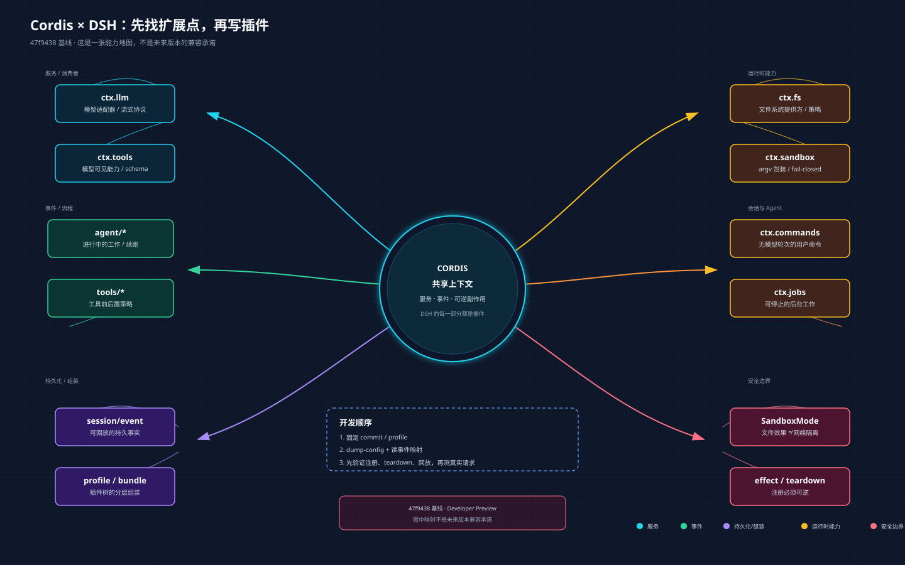

# DeepSeek Harness 扩展点中文能力地图：先找 seam，再写插件

> 适用基线：DeepSeek Harness `47f9438`。DSH 仍处于 Developer Preview；本文的“已记录”只表示官方架构文档在这个 commit 中明确写出，不表示未来版本不会改名或移动。

## 一句话心智模型

DSH 不是在一个“主程序入口”旁边打补丁。官方架构把产品拆成 Cordis 插件树：插件向共享上下文贡献服务、类型化事件和可逆副作用；模型适配器、工具注册表、会话日志和 agent loop 也都属于插件。开发新能力时，先找它要替换或附加的能力 seam，再决定是注册服务、监听事件、组装 profile，还是增加会话事件。



[下载 @2x PNG](../../diagram/cordis-mind-model/cordis-mind-model@2x.png)

## 需求到扩展点决策树

```text
你要改变什么？
├─ 模型接入或模型流式协议
│  └─ ctx.llm：注册 provider / adapter
├─ 给模型增加一个可调用能力
│  └─ ctx.tools：注册工具，schema 进入 prompt 组装
├─ 让某个 agent 拥有不同能力集合
│  └─ agent preset + isolate realm
├─ 执行 shell / 进程
│  ├─ 普通 shell：ctx.shell + ctx.subprocess
│  └─ 持久终端：ctx.terminals + dsh-tool-terminal
├─ 增加用户可以直接运行的命令
│  └─ ctx.commands：不需要模型轮次即可分派
├─ 增加后台工作或可停止任务
│  └─ ctx.jobs：由 job_* 工具收集或停止
├─ 文件系统访问或访问策略
│  └─ ctx.fs provider，或监听 fs/* 事件
├─ 拦截请求、工具调用或轮次
│  ├─ 请求 / 工具：对应 agent/* 或 tools/* 事件
│  └─ 停止轮次：agent/turn-stopping
├─ 给下一次模型请求注入上下文
│  └─ agent.inject()：内容进入下一次获准请求
├─ 增加 UI / 编辑器集成
│  └─ 驱动 ctx.agents，并从 session/event 渲染
├─ 增加可回放的会话状态
│  └─ 扩展 SessionEventMap，并从日志派生渲染
└─ 管理同一会话的目标或续跑
   └─ ctx.goals + agent/* 续跑
```

这张树是“选起点”的地图，不是让你跳过接口文档的捷径。确定起点后，仍要查看当前生成的配置目录、事件映射、包指南和目标 profile 的实际配置树。

## 稳定性标记

| 标记 | 含义 |
| --- | --- |
| `DOC_BASELINE` | 当前固定 commit 的官方架构文档明确记录了该 seam 或映射。 |
| `RUNTIME_SMOKE` | dsh-learn 只验证了无 Key CLI/profile/config 基础入口，尚未验证该 seam 的运行请求。 |
| `PROFILE_DEPENDENT` | 能否使用取决于 profile 是否挂载相应组合包和服务。 |
| `PREVIEW_VOLATILE` | Developer Preview 下的接口，升级后必须重新核对。 |
| `NOT_A_COMPAT_PROMISE` | 这张地图不能证明某个第三方插件、模型或功能已经兼容。 |

当前所有映射至少是 `DOC_BASELINE + PREVIEW_VOLATILE`；没有任何一项因为出现在这张表里就自动变成 `RUNTIME_SMOKE`。

## 三种扩展选择

### 1. 注册服务：新增或替换一项能力

当你的功能本质上是一个可被消费者调用的能力，通常需要同时考虑三种角色：

1. Service Definition：定义接口和事件；
2. Service Provider：提供一个实现；
3. Consumer：使用该能力，通常是工具或 agent 侧消费者。

只写一个 provider 而没有清楚的 definition 和 consumer，通常还不能称为完整 seam。一个包可以承担多个角色，但要把依赖、生命周期和替换边界写清楚。

### 2. 监听事件：观察、包装或改变流程

先确认事件域和分发模式：

| 目的 | 优先检查 | 关键约束 |
| --- | --- | --- |
| 记录必须在重启后仍存在的事实 | `session/event` 与会话事件 | 新的模型可见输入必须能从日志重建 |
| 观察或拦截进行中的 Agent 工作 | `agent/*` | 关注 inbox、步骤、请求、验证和续跑 |
| 加策略或适配器而不制造导入循环 | `fs/*`、`tools/*`、`telemetry/*` | 先找对应能力 seam |
| 包装一个单决策流程 | `waterfall` 事件 | 监听器通常必须调用 `next()` 委托下游 |
| 按序执行并返回结果 | `serial` 事件 | 不要把它当作 waterfall 使用 |
| 并行观察多个监听器 | `parallel` 事件 | 不依赖监听器顺序产生结果 |
| 只观察、不等待结果 | `emit` 事件 | 不要期待返回值 |

### 3. 组装 profile / 组合包：改变一棵运行时插件树

如果需求是“这个 profile 默认多一组能力”，先检查 profile 与组合包，而不是直接改核心循环。官方架构记录了这样的层次：组合包先按 profile 顺序叠加，然后是 profile patch、home patch，最后是命令行 overlay。实际启动树可以用：

```bash
dsh --profile web --dump-config
```

输出中的条目可以由自己的 patch 替换，但替换整个 config 时要确认条目 id、依赖和下游消费者仍然成立。

## Cordis 插件最小纪律

下面是结构示意，不是可以脱离当前包版本直接复制的完整插件 API：

```ts
export function myPlugin(ctx) {
  ctx.inject(/* 声明需要的服务 */)

  const dispose = ctx.effect(() => {
    // 注册服务、工具、适配器或事件监听器
    return () => {
      // teardown：撤销外部副作用
    }
  })

  ctx.on("some/event", (payload, next) => {
    // waterfall 监听器：需要委托时必须调用 next()
    return next(payload)
  })

  return dispose
}
```

写代码前先回答四个问题：

- 依赖哪些 `ctx.<key>` 服务，服务未就绪时是否应该等待？
- 这是 `emit`、`waterfall`、`parallel` 还是 `serial` 事件？
- reload、teardown、profile 切换时，所有监听器、工具和外部资源如何撤销？
- 新增的模型可见内容能否从 `session/event` 重建？

## 常见需求配方

| 想做的事情 | 首选入口 | 不要先做的事情 |
| --- | --- | --- |
| 增加一个模型供应商 | `ctx.llm` adapter | 复制整个 agent loop |
| 给模型加搜索、数据库或内部工具 | `ctx.tools` + tool schema | 直接改 prompt 字符串而不注册工具 |
| 按用户/agent 隔离工具 | agent preset + `isolate` realm | 用全局变量判断当前 agent |
| 记录一次可回放的状态变化 | SessionEventMap + 日志渲染 | 只写内存 Map |
| 过滤某类工具调用 | `tools/*` waterfall | 在每个工具实现里复制一套策略 |
| 注入一次性上下文 | `agent.inject()` | 直接篡改历史日志 |
| 添加一个无模型轮次的 CLI 命令 | `ctx.commands` | 为命令伪造一次模型请求 |
| 管理可停止的后台队列 | `ctx.jobs` | 创建脱离生命周期的 setInterval |
| 把 Bash 搬到远程沙箱 | `ctx.fs` / `ctx.subprocess` / `ctx.sandbox` seam | 为每个工具做专用 fork |
| 加 Web UI 节点 | `ConversationNodeDefinition` + keyed renderer | 在后端输出 HTML 字符串冒充 client 集成 |

## 从想法到可验证贡献

1. 固定 DSH commit、npm 版本、Node.js 和目标 profile。
2. 运行 `--dump-config`，确认目标服务和组合包实际存在。
3. 阅读事件映射，确认分发模式和 listener 约束。
4. 先写一个只验证注册、teardown、重复挂载和配置替换的最小测试。
5. 再验证真实模型请求、工具调用或 UI 行为；无 Key 冒烟不能替代这些测试。
6. 将插件放入 profile 组合包，记录锁文件和精确版本。
7. 由于当前仍是 Developer Preview，升级 DSH 后重新核对所有映射。

## 不要被这张地图误导

- `ctx.tools` 出现在架构表中，不代表任意 profile 都已挂载工具注册表。
- `ctx.llm` 是适配器 seam，不代表某个国产模型或网关已经通过 keyed smoke。
- “事件是扩展点”不代表可以在任意事件里短路；waterfall、serial、parallel、emit 语义不同。
- 一个 `ctx.effect()` 里注册的资源必须有对应 disposer；没有 teardown 的成功演示不算完成。
- 公开教程必须绑定 commit；发现上游变化后，旧地图进入 `STALE`，不能继续当现行 API 保证。

## 参考

- [官方架构文档（固定 commit）](https://github.com/deepseek-ai/deepseek-harness/blob/47f943859bef60e4160492346772ded9b24f765a/docs/architecture.zh.md)
- [官方 Cordis 入门（固定 commit）](https://github.com/deepseek-ai/deepseek-harness/blob/47f943859bef60e4160492346772ded9b24f765a/docs/cordis-primer.zh.md)
- [官方 README（固定 commit）](https://github.com/deepseek-ai/deepseek-harness/blob/47f943859bef60e4160492346772ded9b24f765a/README.md)
- [无 Key CLI 冒烟实验](../labs/rc6-cli-smoke/README.md)
